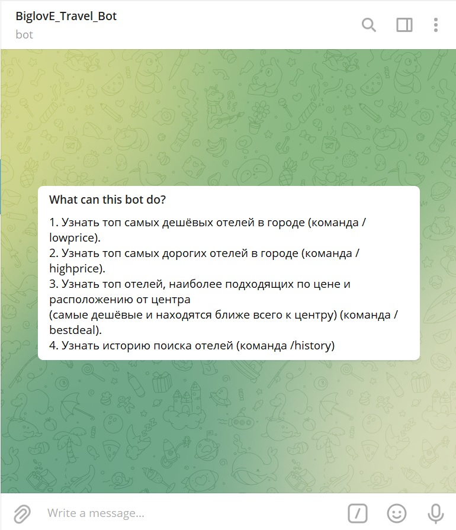
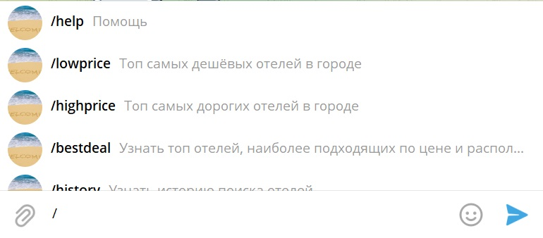

<h1 align="left">BiglovE_Travel_Bot</h1>

  
  
  
  
  
  
  
  
  

## Description

**HOW IT IS WORKS**

At starting page you can read all functions and their discriptions.

## How to use

### /help [__telegram__]:-

- **send** the command '/help' to read desription about all functions.

### /lowprice [__telegram__]-

- **send** the command '/lowprice' to find the chipest hotels in interested city.
- **send** the name of the city in which you want to find hotels.
- **send** the number of hotels you want to consider, but not more than 20.
- **click** the button "yes" if you want to looking for a some photos of hotels, or "no" if you do not interested by what the hotels looks like.

### /highprice [__telegram__]-

- **send** the command '/highprice' to find the most expensive hotels in interested city.
- **send** the name of the city in which you want to find hotels.
- **send** the number of hotels you want to consider, but not more than 20.
- **click** the button "yes" if you want to looking for a some photos of hotels, or "no" if you do not interested by what the hotels looks like.

### /bestdeal [__telegram__]-

- **send** the command '/bestdeal' to find the best offer for the price and distance to the city center.
- **send** the name of the city in which you want to find hotels.
- **send** the number of hotels you want to consider, but not more than 20.
- **click** the button "yes" if you want to looking for a some photos of hotels, or "no" if you do not interested by what the hotels looks like.

### /history [__telegram__]-

- **send** the command '/bestdeal' to read your requests history.

## About the project.

### The foundation

- Bot created by standard function of @BotFather. All functions are developed by Python programming language. You can find all the libraries necessary for the correct work of this bot in requariments.txt

## Project setup

- **use** the  requariments.txt 

## Support

Hey everybody! You can help by pointing out errors in the code or work of the Bot!

